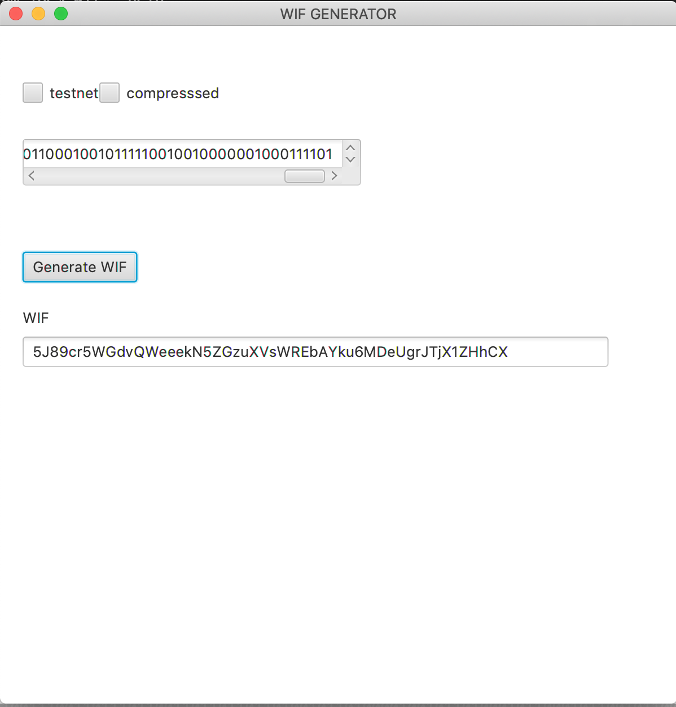

# WIF (wallet import format)

convert a 256 bit binary number to bitcoin WIF

### Download

[**CLI Native App**](https://github.com/j-chimienti/wif/releases/download/0.1.4/wif)

[**CLI jar**](https://github.com/j-chimienti/wif/releases/download/0.1.4/cli-assembly-0.1.0-SNAPSHOT.jar)

[**GUI pkg**](https://github.com/j-chimienti/wif/releases/download/0.1.4/gui-0.1.0-SNAPSHOT.pkg)

### Run

**Native App**
     
     wif 0010100010001111001110011011101111111101001101101101101001011010000100101101000101100010110010110001100010010111110010010000001000101000100010110011100110111011001101101101101001011010000100101101000101100010110010110001100010010111110010010000001000111101
     wif --help

**GUI**
    



### Development

This app is a multi-project build. You can run & build the GUI or CLI application by selecting the project

```.env
# list projects
sbt projects
# select project
sbt project <project>
```

**GUI**

    sbt gui/run
    
**CLI**

    sbt cli/run [options] [<binary>...]

**jar**

```
# select cli project
sbt project cli
# build jar file
sbt assembly
java -jar dist/wif-assembly-0.1.1.jar
```


### Build

**CLI Native App**


The native application can run on any machine and is fastest way to run. 
This is the preferred way to run and can be easily copied to a machine

  1. install [graalvm](https://www.graalvm.org)
  1. Edit variables in 1_setup.sh
  1. `./buildNative.sh`


**CLI JAR**

  `./buildCLI.sh`

**GUI**

  `./buildGUI.sh`
  
note: ./buildALL.sh builds all files


### Benchmarks


*Native App*

    time wif 0010100010001111001110011011101111111101001101101101101001011010000100101101000101100010110010110001100010010111110010010000001000101000100010110011100110111011001101101101101001011010000100101101000101100010110010110001100010010111110010010000001000111101
    
    real    0m0.008s
    user    0m0.002s
    sys     0m0.002s

*jar*

    time java -jar dist/wif-assembly-0.1.1.jar 0010100010001111001110011011101111111101001101101101101001011010000100101101000101100010110010110001100010010111110010010000001000101000100010110011100110111011001101101101101001011010000100101101000101100010110010110001100010010111110010010000001000111101
    
    real    0m0.637s
    user    0m0.823s
    sys     0m0.095s

