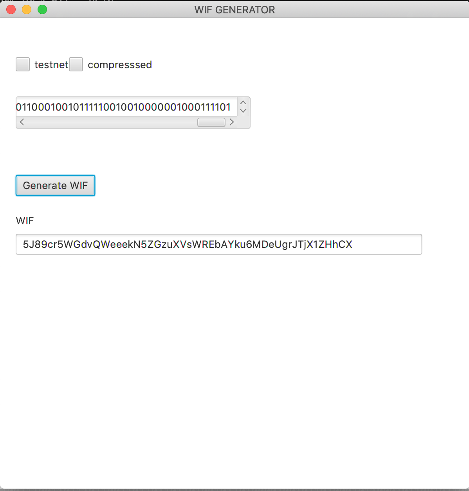

# Bitcoin Private Key Generator

Create secure private keys

**[How to Generate a secure binary key](resources/SECURE_BINARY_GEN.md)**


### Download

[**CLI**](https://github.com/j-chimienti/privateKeyGenerator/releases/download/0.1.0/privateKeyGen)

[**CLI jar**](https://github.com/j-chimienti/privateKeyGenerator/releases/download/0.1.0/privateKeyGen-assembly-0.1.1.jar)

[**GUI dmg**](https://github.com/j-chimienti/privateKeyGenerator/releases/download/0.1.0/privateKeyGen-0.1.1.dmg)


### Run

**Native App**

Usage

```bash
privateKeyGen --help
wif 0.1.2
Usage: wif [options] [binary]

--help
--version
-c, --compress     compress WIF
-t, --testnet      testnet WIF
-a, --address
-n, --NATO format  output NATO format for human readable
-f, --file <file>  read binary from file
-o, --out <file>   write WIF to file
binary             256 bit binary string 001010...
```
     
     privateKeyGen 0010100010001111001110011011101111111101001101101101101001011010000100101101000101100010110010110001100010010111110010010000001000101000100010110011100110111011001101101101101001011010000100101101000101100010110010110001100010010111110010010000001000111101 -n -a

**GUI**
    



### Development

This app is a multi-project build. You can run & build the GUI or CLI application by selecting the project

```.env
# list projects
sbt projects
# select project
sbt project <project>
```

**GUI**

    sbt gui/run
    
**CLI**

    sbt cli/run [options] [<binary>...]

**jar**

  ```
  # select cli project
  sbt project cli
  # build jar file
  sbt assembly
  java -jar dist/wif-assembly-0.1.1.jar
  ```

**Docker**

  ```bash
  ./buildDocker.sh
  docker build -t wif 
  docker run -it wif 
  ```
  


### Build

**CLI Native App**


The native application can run on any machine and is fastest way to run. 
This is the preferred way to run and can be easily copied to a machine

  1. install [graalvm](https://www.graalvm.org)
  1. Edit variables in 
  1. `./buildNative.sh`


**CLI JAR**

  `./buildCLI.sh`

**GUI**

  `./buildGUI.sh`
  
note: `./buildAll.sh` builds all files

**Docker**

  `./buildDocker.sh`


### Benchmarks


*Native App*

    time privateKeyGen 0010100010001111001110011011101111111101001101101101101001011010000100101101000101100010110010110001100010010111110010010000001000101000100010110011100110111011001101101101101001011010000100101101000101100010110010110001100010010111110010010000001000111101
    
    real    0m0.008s
    user    0m0.002s
    sys     0m0.002s

*jar*

    time java -jar wif-assembly-0.1.1.jar 0010100010001111001110011011101111111101001101101101101001011010000100101101000101100010110010110001100010010111110010010000001000101000100010110011100110111011001101101101101001011010000100101101000101100010110010110001100010010111110010010000001000111101
    
    real    0m0.637s
    user    0m0.823s
    sys     0m0.095s

